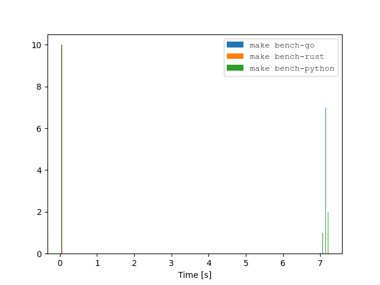
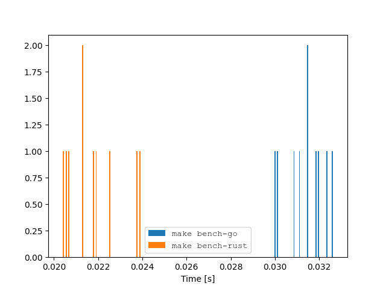

# Sudoku-solving based language benchmark

This is a benchmark of a Sudoku solver written in various languages. The goal is two-fold:
- to compare the performance of different languages
- it's my `Hello, world!` when I learn a new language


## Results

The results are for a 9x9 Sudoku, with 3x3 blocks. The benchmark is run on a 2022 MacBook Pro, with a M1 processor and 16GB of RAM.

### For an easy Sudoku

| Command             |    Mean [ms] | Min [ms] | Max [ms] |     Relative |
| :------------------ | -----------: | -------: | -------: | -----------: |
| `make bench-go`     |    7.3 ± 0.6 |      6.2 |      9.5 |  1.18 ± 0.17 |
| `make bench-rust`   |    6.2 ± 0.7 |      5.2 |      9.2 |         1.00 |
| `make bench-python` | 421.1 ± 15.4 |    406.0 |    453.1 | 67.95 ± 8.21 |


### For a hard Sudoku






| Command             |     Mean [ms] | Min [ms] | Max [ms] |       Relative |
| :------------------ | ------------: | -------: | -------: | -------------: |
| `make bench-go`     |    32.8 ± 0.7 |     31.5 |     34.5 |    1.69 ± 0.08 |
| `make bench-rust`   |    19.4 ± 0.9 |     18.1 |     22.7 |           1.00 |
| `make bench-python` | 7127.5 ± 51.9 |   7039.1 |   7212.9 | 367.95 ± 17.07 |


### For a very hard Sudoku, made especially against backtracking

| Command             |         Mean [ms] | Min [ms] | Max [ms] |        Relative |
| :------------------ | ----------------: | -------: | -------: | --------------: |
| `make bench-go`     |       507.8 ± 3.3 |    503.7 |    513.2 |     1.91 ± 0.02 |
| `make bench-rust`   |       266.4 ± 2.1 |    263.8 |    270.3 |            1.00 |
| `make bench-python` | 439142.3 ± 4526.4 | 435062.2 | 448740.0 | 1648.47 ± 21.52 |

*Yes, the Python version takes 7 minutes to solve this Sudoku, while the other languages answer in a second.*

## Reproduce

Every benchmark must have a reproduce section, along with the usual License and Contributing sections. Not doing so is **wrong**. *Hi, [TurboPack](https://turbo.build/pack)*

### Prerequisites

- [Hyperfine](https://github.com/sharkdp/hyperfine)
- [Rust](https://www.rust-lang.org/tools/install)
- [Go](https://golang.org/doc/install)
- [Python](https://www.python.org/downloads/)
  - `pip install numpy rich matplotlib argcomplete`

### Run

```bash
make bench-all
```

## FAQ

As these are my `Hello World`s, the code is probably not idiomatic. I'm open to suggestions and PRs. 

> "The xxx implementation is not optimized for performance!"

This is your language's fault, not mine: I would be happy to code a faster algorithm, but if the language doesn't make it easy, I'm not going to do it.
